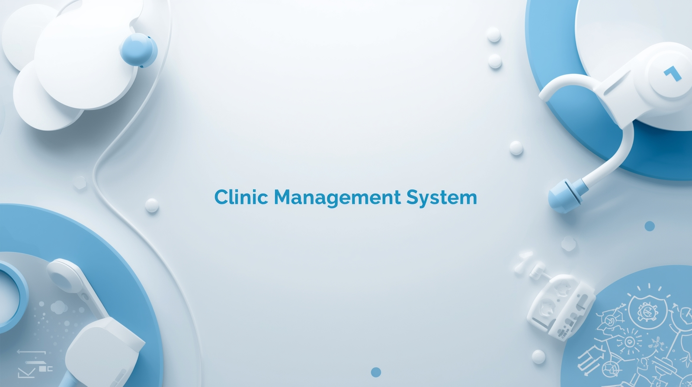

# 🏥 Clinic Management System

**Status:** 🚧 _Under Development_

Multi-user LAN-based Clinic Management System built with **C# WinForms** and **SQL Server Express**.  
Includes role-based access, patient & appointment management, and Excel reporting.  
This project is a **real-world client-server desktop application** designed to simulate professional development experience.

---

## 🎯 Project Overview

The **Clinic Management System** is a desktop application designed to help clinics manage daily operations efficiently.  
It supports multiple users connected through a **local network (LAN)** and provides secure access control based on user roles.

---

## 🧩 Technologies Used

- **Programming Language:** C# (.NET Framework)
- **Database:** SQL Server Express
- **UI Framework:** Windows Forms (WinForms)
- **Architecture:** 3-Tier (Presentation, Business, Data Access Layers)
- **Reporting:** Microsoft Excel (via Export to Excel)

---

## 🏗️ System Architecture

- **Server:** Hosts the central SQL Server database.
- **Clients:** Run the desktop application and connect to the server through LAN.
- **Connection Type:** Remote SQL connection (supports Integrated Security).

---

## 📋 Database Design

The system uses four main tables:

| Table            | Description                                                   |
| ---------------- | ------------------------------------------------------------- |
| **Users**        | Stores user credentials and roles (Admin, Receptionist, etc.) |
| **Patients**     | Manages patient information such as name, contact, and notes  |
| **Services**     | Lists available clinic services and their prices              |
| **Appointments** | Handles scheduling and tracking of patient appointments       |

---

## 🗓️ Development Roadmap

**Week 1:**

- Install SQL Server Express and configure remote access
- Create main database and 4 tables
- Build login and user management forms

**Weeks 2–3:**

- Develop patient and service management modules (CRUD operations)
- Implement role-based access control

**Weeks 4–5:**

- Create appointment scheduling with calendar view
- Build simple reporting module

**Week 6:**

- Add daily reports and Excel export
- Test application across multiple devices on LAN

---

## 🧠 Skills Developed

- Building full desktop applications with **C# WinForms**
- Designing and managing databases using **SQL Server**
- Implementing **multi-user systems** and **role-based permissions**
- Working with **LAN-based client-server** applications
- Creating and exporting professional reports

---

## 🖼️ Screenshots

| Login Screen                           | Users                                     |
| -------------------------------------- | ----------------------------------------- |
|  |  |

| Patient Form                                    | Login Form                             |
| ----------------------------------------------- | -------------------------------------- |
|  |  |

---

## 👨‍💻 Developer

Developed individually by **[Wael Mohammed](https://www.linkedin.com/in/wael-mohammed-sharif)**  
Focus areas: _C#, .NET Framework, ADO.NET, 3-Tier Architecture, and SQL Server._

---

## ⚠️ Note

> This project is currently under active development.  
> Some modules may not be complete or fully tested yet.

---

## 📄 License

This project is for **educational and training purposes**.  
You are free to explore, learn, and adapt ideas — please credit the original developer.
