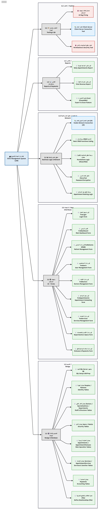
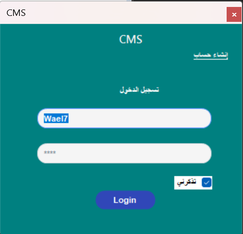
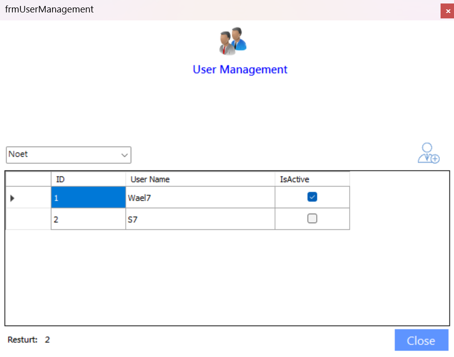
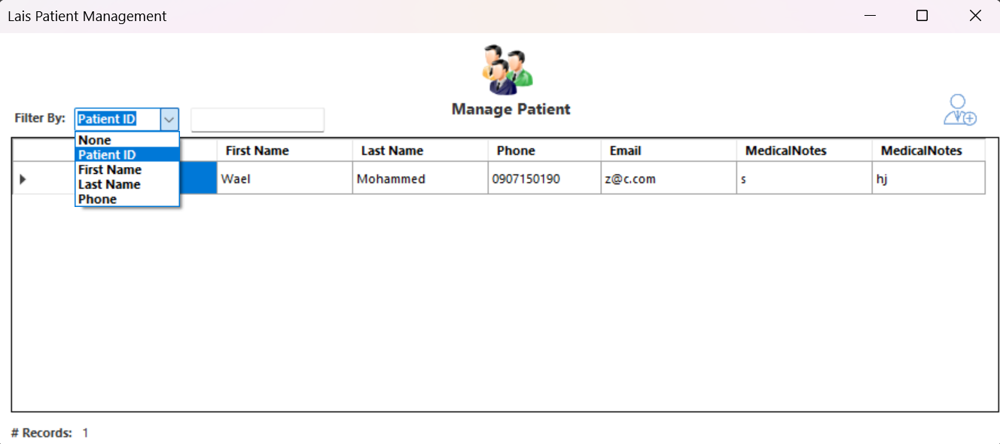
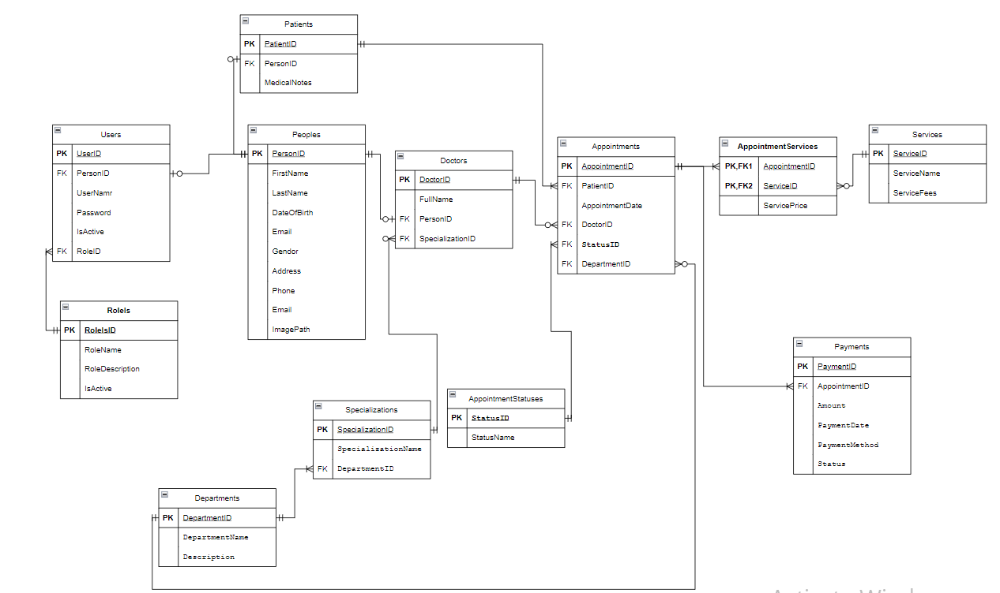

# 🏥 Clinic Management System

**Status:** 🚧 _Under Active Development_

A high-fidelity, **Multi-user LAN-based Clinic Management System** built with **C# WinForms** and **SQL Server Express**.  
This project combines database design, user authentication, appointment scheduling, billing, and reporting — all within a professional **Client–Server architecture**.

---

## 🎯 Project Overview

The **Clinic Management System** is a **desktop application** designed to simulate a real-world commercial environment for small medical clinics.  
It supports **multiple users over LAN**, with secure **Role-Based Access Control (RBAC)** and structured workflows for managing patients, doctors, services, appointments, and payments.

---

## 🧩 Technologies Used

| Component        | Technology                                                |
| ---------------- | --------------------------------------------------------- |
| **Language**     | C# (.NET Framework)                                       |
| **Database**     | SQL Server Express (or SQLite for testing)                |
| **UI Framework** | Windows Forms (WinForms)                                  |
| **Architecture** | 3-Tier (Presentation, Business Logic, Data Access Layers) |
| **Reporting**    | ClosedXML (Excel Export)                                  |
| **Connectivity** | LAN-based Client–Server Model                             |

---

## 🏗️ System Architecture

- **Server:** Hosts the central SQL Server database with remote access enabled.
- **Clients:** Run the C# WinForms application, connecting through LAN.
- **Security:** Built-in authentication and **Role-Based Authorization** to control access and UI visibility.

---

## 📋 Database Design

A normalized relational design with **13 core tables** ensuring efficiency, accuracy, and scalability.

| Category                 | Table Name                            | Description                                                |
| ------------------------ | ------------------------------------- | ---------------------------------------------------------- |
| **Identity & Access**    | Peoples, Users, RoleIs                | Manage personal data, logins, and permissions.             |
| **Medical**              | Doctors, Departments, Specializations | Represent the medical staff and organizational structure.  |
| **Operations**           | Appointments, AppointmentStatuses     | Central scheduling and status tracking.                    |
| **Finance**              | Payments                              | Manage payment history and methods.                        |
| **Services**             | Services, AppointmentServices         | Define offered procedures and their usage per appointment. |
| **Inventory (optional)** | Inventories, AppointmentInventories   | Track materials and consumables per visit.                 |

---

## 🔐 Security & Login Module

- **Login Screen:** Authenticates users through secure SQL connection.
- **User Management:** Admin-only form to add/edit users and assign roles.
- **Role-Based Permissions:** Dynamically shows or hides UI components according to user role.

---

## ⚙️ Core Management Modules (CRUD)

- **Patient Management:** Add, edit, delete, and search patient records.
- **Service Management:** Maintain services list and pricing.
- **Inventory Management:** Manage stock items and prices.
- **Doctor & Department Management:** Assign specializations and organize staff.

---

## 📅 Appointment & Billing Module

- **Appointment Scheduling:**  
  Book appointments by selecting a patient, doctor, date, and time.  
  Update appointment statuses (Scheduled, In-Progress, Completed, etc.).

- **Billing System:**  
  Link appointments with services and consumed materials.  
  Automatically calculate and record payment transactions.

---

## 📊 Reporting Module

- **Reports:**

  - Daily Appointments Report
  - Revenue Summary Report

- **Export:**  
  Export any report to Excel using **ClosedXML**.

---

## 🗓️ Development Roadmap

| Week    | Focus                | Tasks                                                         |
| ------- | -------------------- | ------------------------------------------------------------- |
| **1**   | Setup                | Design database, configure SQL Server (LAN), build login form |
| **2–3** | CRUD Modules         | Patients, Services, Users, and Roles                          |
| **4–5** | Scheduling & Billing | Appointments and payment integration                          |
| **6**   | Reports & Testing    | Excel reports, LAN testing, debugging                         |

---

## 🧠 Core Skills Developed

- Database Design (One-to-One & Many-to-Many relationships)
- Network Programming (Client–Server over LAN)
- Role-Based Access Control (RBAC)
- ADO.NET / ORM-based Data Handling
- Excel Reporting (ClosedXML)
- 3-Tier Architecture Implementation

---

## 🖼️ Screenshots

| Login Screen                           | User Management                           |
| -------------------------------------- | ----------------------------------------- |
|  |  |

| Patient Management                              | Clinic Database                                     |
| ----------------------------------------------- | --------------------------------------------------- |
|  |  |

---

## 👨‍💻 Developer

Developed individually by **[Wael Mohammed](https://www.linkedin.com/in/wael-mohammed-sharif)**  
Focus areas: _C#, .NET Framework, ADO.NET, 3-Tier Architecture, and SQL Server._

---

## 📄 License

This project is for **educational and training purposes**.  
You are free to explore, learn, and adapt ideas — please credit the original developer.

---
